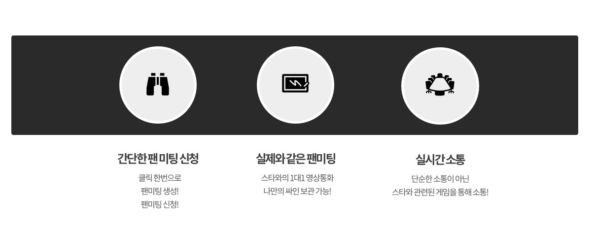
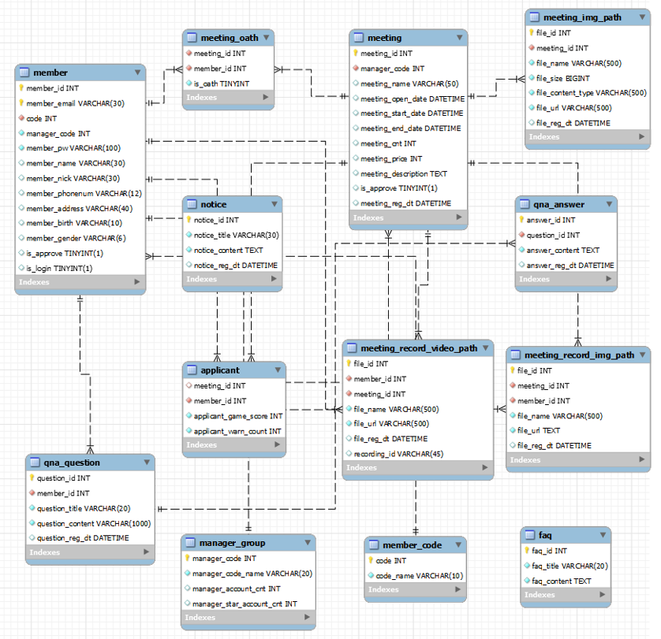
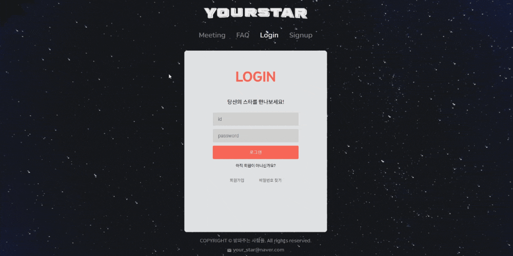
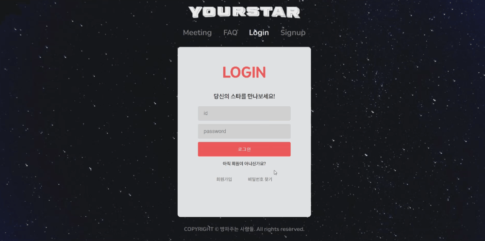
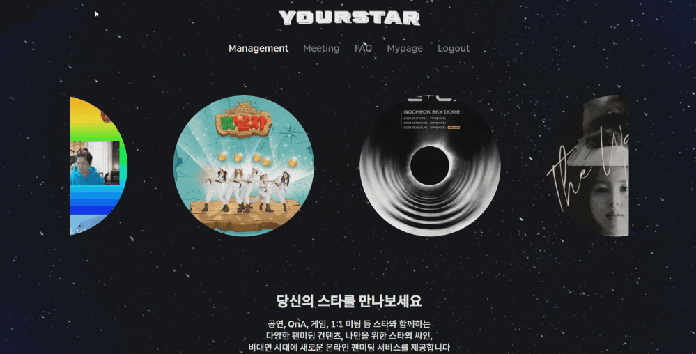
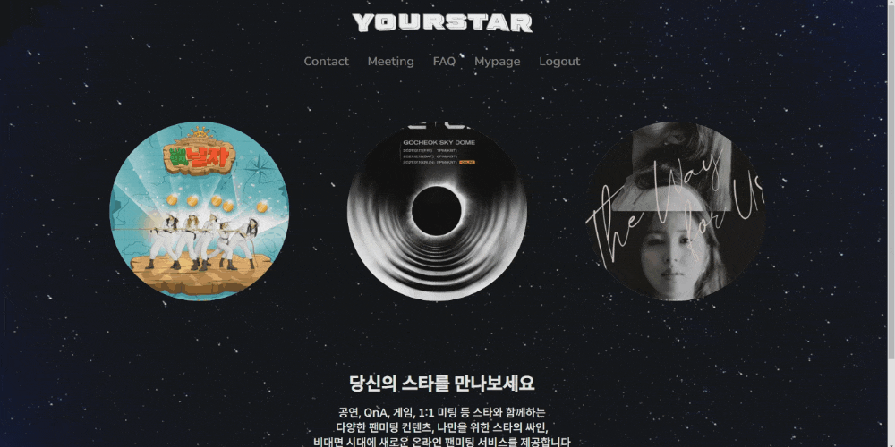
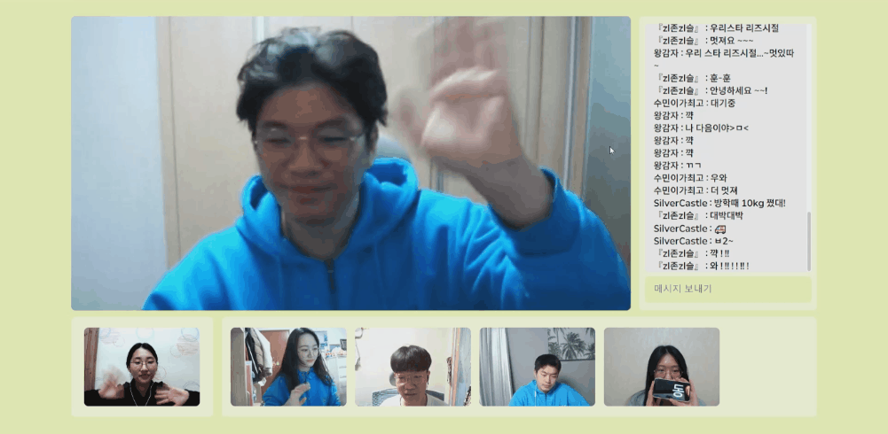

# YourStar 🌟

## **1.  서비스 소개**

### **주제**

비대면 팬미팅 서비스 `YourStar`

<br>


### **개요**

대면 및 비대면 팬미팅의 장점을 살린 스타와 팬들을 위한 편리한 비대면 팬미팅 서비스



<br>


### YourStar의 특장점

1. 손쉬운 비대면 팬미팅 신청 및 참가

2. 현재까지 출시되어있는 플랫폼(V-Live, 인스타라이브, 버블 등) 및 비대면 팬미팅 방식의 단점 보완
   - 양방향 소통 및 엔터테인적 요소(OX 게임, 초성게임, QnA 등)와 1대1 팬미팅을 통하여 팬들과의 유대감 증진

3. 스타의 needs 반영 

   - 기존 비대면 팬싸인회에서는 관계자가 전화를 하나하나 걸고 타이머를 세팅하는 등의 번거로움이 있으나, YourStar에서는 1대1 팬미팅에서의 자동 입장 및 퇴장으로 편리함 제공
   
   
      - 부적절한 단어 필터링, 경고 및 강퇴를 통한 스타 인권 보호
   
      - 공연모드, 게임, QnA 등의 원클릭 컨텐츠를 제공으로 편리한 진행 가능
   
      - 미팅에 참여했던 팬들의 정보 조회
      - 미팅 시 진행했던 게임 등수 조회
   
4. 팬들의 needs 반영

   - 기존 비대면 팬싸인회에서는 미리 사인을 해서 보내주는 방식으로 팬들이 가장 원하는 추가 코멘트 작성 불가능. 하지만 YourStar의  실시간 사인 받기 기능으로 자신만을 위한 스페셜한 사인 받기 기능 탑재 

   - 1대1 팬미팅 자동 녹화 및 저장

<br>


### **개발기간**

##### **2022-01-10 ~ 2022-02-18(6주)**

<br>


### **팀원**

```
박동준 : 팀장 / Frontend / Design / WebRTC

손은성 : Frontend / Design / WebRTC

지수민 : Frontend / Design / 동작 인식

안영원 : BackEnd / 서버 관리 및 배포 / WebRTC

강소현 : BackEnd / 동작 인식 

김지슬 : BackEnd / WebRTC
```

<br>


## **2. 서비스 기획**

### 배경

코로나 19로 인한 팬미팅 및 콘서트가 어려워지고 비대면 플랫폼을 활용한 소통이 증가하였습니다. 하지만 단방향 소통, 비매너 유저 관리의 부재, 비대면 영상 팬싸인회 설정의 번거로움 등의 다양한 단점으로 인해 스타와 팬의 아쉬움이 커지고 있는 상황입니다.

따라서 이러한 단점들을 보완할 뿐만 아니라 스타와 팬의 유대감 증진을 위한 다양한 기능을 제공하고자 YourStar 서비스가 만들어지게 되었습니다.


### FrontEnd

#### 1) **UI 디자인**


#### <br>

### BackEnd

#### 1) **DB ERD 설계**



<br>


## 3. 기술 스택


<br>


## **4. 주요 기능** 소개

#### 사용자별 역할 및 권한

- 관리자 : 팬미팅 개설 승인/거절 권한, 회원 정보 조회 권한, 관계자 계정 생성 권한, 팬미팅 중 비매너 유저 경고 및 강퇴 권한
- 관계자(소속사) : 팬미팅 개설 신청 권한, 팬미팅 중 비매너 유저 경고 및 강퇴 권한, 팬미팅에 참가한 유저 정보 조회 권한

- 일반 회원 : 팬미팅 참가 신청, 자신이 참가한 팬미팅의 사인, 녹화 조회
- 공통 권한 : 로그인, 로그아웃, 회원가입, 마이페이지 조회/수정, 팬미팅 전체 및 상세 조회, FAQ 조회
- 비회원 이용 가능 서비스 : 회원가입, 팬미팅 전체 및 상세 조회,  FAQ 조회

<br>


### 🪐 홈페이지

#### 1) **회원가입**



> 회원가입을 통해 YourStar의 회원(**일반 회원 등급**)이 될 수 있습니다.  회원가입 후 이메일 인증까지 완료 시, 로그인이 가능합니다.

<br>

#### 2) **비밀번호 초기화**



> **일반 회원** 사용자가 비밀번호가 기억나지 않을 시, 비밀번호 찾기를 통해 가입했던 메일로 초기화된 비밀번호를 받을 수 있습니다.

<br>

#### 3) **관계자 계정 생성**



> YourStar로부터 **인증받은 소속사**는 **관리자**가 관계자 계정 생성을 통해 원하는 수만큼의 **관계자** 계정을 메일로 받을 수 있습니다.

<br>

#### 4) **팬미팅 개설 신청**



> **관계자**가 팬미팅 개설 신청을 할 수 있습니다. **관리자**가 검수 후, 승인을 하게 되면 팬미팅 목록에 보여지게 됩니다.

<br>

#### 5) **팬미팅 개설 요청 승인**


> **관리자**는 **관계자**가 요청한 팬미팅을 검수 후 승인 또는 거절할 수 있습니다. 

<br>

#### 6) 팬미팅 신청


> 팬미팅에 참여하고 싶은 **일반 회원**은 카카오페이를 통해 결제 완료 시, 팬미팅 예약이 완료됩니다.

<br>


### **미팅룸**

#### 1) 팬미팅 입장


> 팬미팅 입장 전, 비디오와 마이크 체크 및 사용자가 원하는 미팅룸의 배경 색을 선택할 수 있습니다. 

<br>

#### 2) 공연 모드


> **관계자(스타)**가 공연하는 동안 팬들은 채팅 및 이모티콘으로 호응할 수 있습니다.

<br>

#### 3) 랜덤 추첨


> **관계자(스타)**가 랜덤 추첨 버튼을 누를 시, 팬미팅에 참가한 팬들 중 한 명이 랜덤으로 선택됩니다.

<br>

#### 5) QnA


> **관계자(스타)**가 QnA 시작 버튼을 누르면 미팅에 참여한 **팬(일반 회원)**들의 화면에 질문을 전송할 수 있는 창이 나타납니다.
> **관계자(스타)**가 QnA 종료 버튼을 누르면 **팬(일반 회원)**들의 화면에 열려있는던 질문 창이 닫힙니다.
> **관계자(스타)**는 QnA 리스트를 눌려 **팬(일반 회원)**으로부터 받은 질문을 조회 및 팬(일반 회원)과 공유가 가능합니다.

<br>

#### 6) O, X 게임


> 관계자(스타)가 게임시작 버튼을 누르면 팬(일반 회원)의 동작 인식을 시작합니다. 
> 팬(일반 회원)은 O, X 중 하나의 동작을 취하여 정답을 표시할 수 있습니다.
>
> 모든 팬의 인식이 끝나고 관계자(스타)가 O, X 중 하나의 버튼을 클릭 시, 팬(일반 회원)에게 정답이 표시되고 점수가 기록됩니다. 정답을 맞추지 못한 팬(일반 회원)의 화면은 꺼지게 됩니다. 

<br>

#### 7) 초성 게임


> **관계자(스타)**가 정답을 입력하면 초성으로 변환되어 팬들에게 전송되며, 팬은 문제를 맞출 수 있습니다. 
> 정답을 맞춘 팬은 선착순 3명까지 점수가 쌓이게 됩니다.

<br>

#### 8) 팬미팅 종료



> **관계자(스타)**가 팬미팅 종료를 누를 시, 팬미팅에 참여했던 모든 사용자가 팬미팅에서 나가게 되며 참가했던 팬미팅의 상세 보기로 이동합니다.
>
> 1대1 팬미팅에 참여한 사용자라면 Mypage의 추억보관함에서 스타의 싸인과 1대1 녹화 영상을 조회 및 다운로드 할 수 있습니다.

<br>

## 5. 실행 방법

소스코드 다운로드

```bash
$ git clone https://lab.ssafy.com/s06-webmobile1-sub2/S06P12E204.git
```

<br>

### BackEnd

1. 디렉토리 이동

   ```bash
   $ cd Backend
   ```

2. gradle 프로젝트를 빌드합니다.

   ```bash
   $ ./gradlew build
   ```

    - 정상적으로 빌드가 완료되면 `build` 폴더가 생성된 것을 확인 가능

    - `./gradlew build` 가 안되면 아래 명령어를 실행 후 빌드

      ```bash
      $ chmod 777 gradlew
      ```

3. 실행

   ```bash
   $ java -jar build/libs/yourstar-0.0.1-SNAPSHOT.jar
   ```


<br>

### FrontEnd

1. 디렉토리 이동

   ```bash
   $ cd Frontend
   ```

2.  필요한 pacakge 설치

   ```bash
   $ npm i
   ```

3.  실행

   ```bash
   $ npm start
   ```

<br>

### WebRTC

1. 아래 링크 참고하여 OpenVidu 서버를 설치 (단, Linux 환경에서만 설치 가능) 

   https://docs.openvidu.io/en/stable/deployment/ce/on-premises/

2. OpenVidu 실행

   ```
   ./openvidu start
   ```

3. repository에 포함된 OpenVidu 클라이언트를 실행합니다.

   ```bash
   $ cd Backend/mvn package exec:java
   ```
